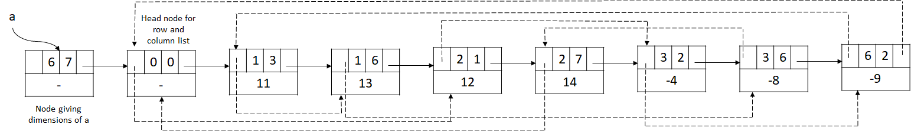

# Problem 1

Write a recursive function called min_max that returns the minimum and the maximum values of an array of integers.  

Prototype: `void min_max(int tab[], int sz, int *min, int *max)`

Input format  
The first line contains the number of tests;  
For each test: a number indicating the size of the array n, then n integers.

# Problem 2

Consider the following node definition:
```C
typedef struct node{
     int data;
     struct node* next;
} node;
Write a recursive function called uniqueNodes that keeps only unique nodes in the list.
```
Prototype: `void uniqueNodes(node** headRef)`

Input format  
Each elements of the list is on a line.  
Your function complexity should be in O(n2).

# Problem 3

One can prove that when matrices were sparse (i.e. many of the entries were zero), then much space and computing time could be saved if only the nonzero terms were retained explicitly.

Each nonzero term is represented by a node. These nodes are linked together to form two circular lists. 

These two lists share a common head node. In ajout, a node is added to contain the dimensions of the matrix. 

The following 6 × 7 matrix

$\left[\begin{array}{ccc}
0 & 0 & 11 & 0 & 0 & 13 & 0\\
12 & 0 & 0 & 0 & 0 & 0 & 14\\
0 & -4 & 0 & 0 & 0 & -8 & 0\\
0 & 0 & 0 & 0 & 0 & 0 & 0 \\
0 & 0 & 0 & 0 & 0 & 0 & 0 \\
0 & -9 & 0 & 0 & 0 & 0 & 0\\
\end{array}\right]$

has the following representation:



Where:

Solid links represent row list.  
Dashed links represent column list.  
Click here to open the image in a new tab.

Every other node has 5 fields: down, row, col, right, and value. The down field is used to link to the next nonzero term in the same column and the right field links to the next nonzero term in the same row. Thus if aij≠0, then there is a node with value = aij, row =i and col = j. 

The operation we shall consider is that of reading a sparse matrix and obtaining its linked representation. We shall assume that the first input line consists of n (the number of rows) and m (the number of columns). This line is followed by r (the number of nonzero terms) lines of input; each of these is a triple of the form (i j aij). These triples consist of the row, col, and value of the nonzero terms of the matrix. It is further assumed that these triples are ordered by rows and within rows by columns.

For example, the input for the 6 × 7  sparse matrix, which has 7 nonzero terms, would take the following form:

$\left[\begin{array}{ccc}
6 & 7\\
1 & 3 & 11\\
1 & 6 & 13\\
2 & 1 & 12\\
2 & 7 & 14\\
3 & 2 & −4\\
3 & 6 & −8\\
6 & 2 & −9\\
\end{array}\right]$

Consider the following matrix definition:

```C
typedef struct {
     int row, col, value;
} element;
typedef struct matrix{
     element data;
     struct matrix *down, *right;
}matrix;
```
Write a function that creates the linked representation of a sparse matrix.

Prototype: `matrix* buildMatrix()`

Your function complexité should be in $O(r^2)$.

