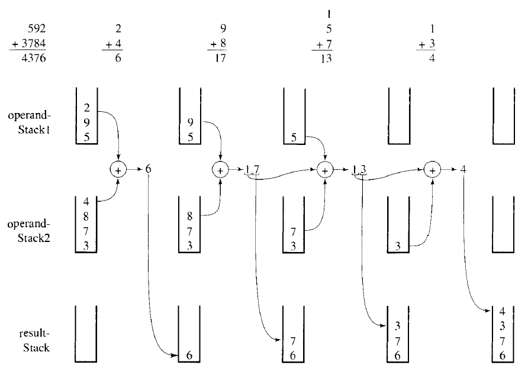

# Problem 1

Write a C function that returns the Nth element of a stack. The top element is element number 1.

You may note the following:

Stack ADT is available:  
Type: stack   
Operations:  
`stack CreateStack()`  
`int isEmptyStack(stack)`  
`int isFullStack(stack)`  
`int Push(stack *, element )`  
`int Pop(stack *)`  
`int Top(stack, element *)`  

Type element is of type integer.  
Input: The number N, followed by the elements to be pushed into the stack.  
Return -1 if no such element exists.  
Prototype: `int nth(stack s, int N)`

# Problem 2

Write a C function that inserts an element e in a stack at position k (the top element is considered at position 1).

You may note the following:

Stack ADT is available:  
Type: stack   
Operations:  
`stack CreateStack()`  
`int isEmptyStack(stack)`  
`int isFullStack(stack)`  
`int Push(stack *, element )`  
`int Pop(stack *)`  
`int Top(stack, element *)`  

Type element is of type integer.  
Input: The number k, the number e, followed by the elements to be pushed into the stack.  
Return 0 if there's no more room to push e.  
Prototype: `int insert(stack *s, element e, int k)`

# Problem 3

Write a C function that deletes the kth element of a stack of integers (the top element is considered at position 1).

You may note the following:  
Stack ADT is available:  
Type: stack   
Operations:   
`stack CreateStack()`  
`int isEmptyStack(stack)`  
`int isFullStack(stack)`  
`int Push(stack *, element )`  
`int Pop(stack *)`  
`int Top(stack, element *)`  

Type element is of type integer.  
Input: The number k, followed by the elements to be pushed into the stack.  
Return 0 if no such position exists .  
Prototype: `int delete_pos(stack *s, int k) `

# Problem 4

Write a C function to check whether a string is palindrome or not using a stack.
A palindrome is a word, phrase, number or other sequence of units that has the property of reading the same in either direction. A few examples of palindrome strings are: madam, dad and radar.

You may note the following:  
Stack ADT is available:  
Type: stack   
Operations:   
`stack CreateStack()`  
`int isEmptyStack(stack)`  
`int isFullStack(stack)`  
`int Push(stack *, element )`  
`int Pop(stack *)`  
`int Top(stack, element *)`  
Type element is of type char.  
Input: a string.  
Prototype: `int isPalindrome(char *str)`   

# Problem 5

Design a method for keeping two stacks within a single linear array so that neither stack overflows until all of memeory is used and an entire stack is never shifted to a different location within the array.

Write usual stack routines to manipulate the two stacks.
Hint : The two stacks grow towards each other. In your functions, use an extra integer parameter to identify the stack to be used.

```C
#define N 10
typedef int  element;
typedef struct  {
	element data[N]; 
	int top1,top2;
} stack;
```

# Problem 6

Consider a language that does not have arrays but does have stacks as a data type. That is, one can declare stack s; and the operations push, pop, top operations are defined. Show how a one-dimensional array can be implemented by using these operations on two stacks.

```C
typedef struct  {
	stack s; 
	int nb_elements;
} Array;
```

# Problem 7

Write a recursive function that reverses the elements of a stack by using only stack operations.

# Problem 8

Consider adding very large numbers. The largest magnitude of integers is limited, so we are not able to add 18,274,364,583,929,273,748,459,595,684,373 and 8,129,498,165,026,350,236, since integer variables cannot hold such large values, let alone their sum. The problème can be solved if we treat these numbers as strings of numerals, store the numbers corresponding to these numerals on 2 stacks, and then perform addition by popping numbers from the stacks. The following figure shows an example of application. In this example, numbers 592 and 3784 are added.

