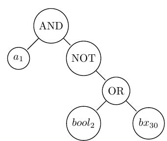
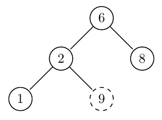
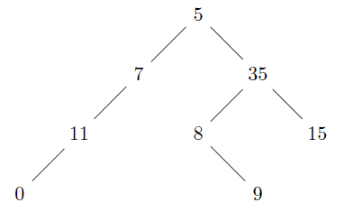

# Preliminary

stack and queue ADTs are available when necessary. The element type is a pointer to a Btree.
In all binary trees questions, consider the following declaration:

```C
typedef ... element;
typedef struct node
{
	element data;
	struct node *left,*right;
} *Btree;
typedef Btree BST;
//For static trees :
typedef struct
{
	element root; 
	int left_subtree,  right_subtree; 
} node;

typedef struct
{
	node data[N];
	int root_index; 
} Btree;
```

# Problem 1

A binary tree is said to be balanced if both of its subtrees are balanced and the height of its left subtree differs from the height of its right subtree by at most 1.
Write a recursive C function to determine whether a given binary tree is balanced

# Problem 2

A Boolean expression is represented as a binary tree of strings (BT) in which internal nodes contain the logical connectors AND, OR and NOT, and leaves contain strings representing Boolean variables.

Ex: the expression a1 AND NOT (bool2 OR bx30) is represented by the following BT:



An interpretation of an expression is represented by a set of pairs  that associates to each variable of the expression a Boolean value.

Ex: the set (,,) associate the value 1 (True) to the Boolean variables a1 and bx30 and the value 0 (False) to bool2.

Assume that we use BT dynamic implementation; we give the declaration of the types Interpretation and Expression.

```C
#include <string.h>
typedef struct  {
	char var[10];
	int val;
} Couple;
typedef struct node{ 
	char value[10]; 
	struct node *left, *right; 
}  *Expression;
typedef struct {
	Couple arr[100];
	int size;
} Interpretation;
```
1. Write a function that returns the Boolean value of a variable in an interpretation if it exists.
2. Write a function `int Evaluate(Interpretation I, Expression E, int *Value)` that computes the value of the expression E according to the interpretation I.
3. Now, we want to test whether a given expression is valid (true for all interpretations).  
Assume the existence of an array containing all interpretations of a given expression (all possible variables combinations), write a function `int Valid(Interpretation arrayInter[], int NBInter, Expression E)` that checks the validity of the expression.

# Problem 3

Write a function that checks whether a given binary tree is a BST or not.

Consider the following simple program. For each node, check if the left node of it is smaller than the node and the right node is greater than the node. This approach is wrong as this will return true for the below binary tree. Checking only at current node is not enough.

Think of getting the correct algorithm.



```C
int isBST(Btree tree)
{
    if(tree == NULL)    
        return 1;

    /* false if left is > than root */
    if(tree->left != NULL && tree->left->data > tree->data)
        return 0;

    /* false if right is < than root */
    if(tree->right != NULL && tree->right->data < tree->data)
        return 0;

    /* false if, recursively, the left or right is not a BST */
    if(!isBST(tree->left) || !isBST(tree->right))
        return 0;

    /* passing all that, it's a BST */
    return 1;
}
```

# Problem 4

The following function checks whether a given binary tree dynamically implemented is a BST or not.
```C
int isBST(Btree tree)
{
     if(tree == NULL) return 1;
     if(tree->left != NULL && FindMax(tree->left) > tree->data) return 0;
     if(tree->right != NULL && FindMin(tree->right) < tree->data) return 0;
     if(!isBST(tree->left) || !isBST(tree->right)) return 0;
     return 1;
}
```
`FindMax` and `FindMin` are 2 auxiliary functions that returns the maximum (resp. minimum) element of a BST.

```C
element FindMin(Btree tree)
{
     if (tree==NULL) return INT_MAX;
     return min(tree->data,min(FindMin(tree->left),FindMin(tree->right)));
}

element FindMax(Btree tree)
{
     if (tree==NULL) return INT_MIN;
     return max(tree->data,max(FindMax(tree->left),FindMax(tree->right)));
}
```
Note that the inorder traversal of BSTs produces sorted lists. While traversing the BST in inorder, and at each node, check the condition that its key value should be greater then the key value of its previous visited node.

Write a recursive function that checks whether a given binary tree is a BST or not given the above approach.

# Problem 5

Given 2 BSTs, write a function that checks whether the elements of both BSTs are the same or not. 

# Problem 6

Given 2 BSTs, knowing that the inorder traversal of BSTs produces sorted lists, write a function that checks whether the elements of both BSTs are the same or not. 

# Problem 7

Write a function that takes as input a binary tree dynamically implemented and print out the tree in zig zag level order (i.e., from left to right, then right to left for the next level and alternate between). 



The zig zag level order output of the tree above is: 5 35 7 11 8 15 9 0

Hint: use two stacks: one for even levels and one for odd levels.

# Problem 8

Given a Balanced Binary Search Tree and a target sum, write an iterative function that returns true if there is a pair with sum equals to target sum, otherwise return false.

Expected time complexity is O(n). Any modification to Binary Search Tree is not allowed. 

Method: traverse BST in Normal Inorder and Reverse Inorder simultaneously. In reverse inorder, start from the rightmost node which is the maximum value node. In normal inorder, start from the left most node which is minimum value node. Add sum of current nodes in both traversals and compare this sum with given target sum. If the sum is same as target sum, return true. If the sum is more than target sum, move to next node in reverse inorder traversal, otherwise move to next node in normal inorder traversal. If any of the traversals is finished without finding a pair, return false. 

# Problem 9

Write a function that prints the level order data in reverse order. For example, the output for the below tree should be: 0 9 11 8 15 7 35 5