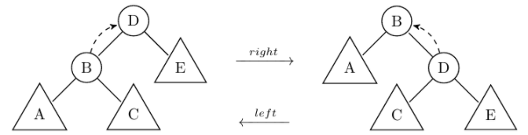
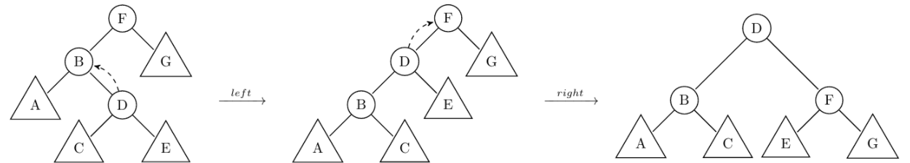

# Preliminary

stack and queue ADTs are available when necessary. The element type is a pointer to a Btree.  
In all binary trees questions, consider the following declaration: 
```C
typedef ... element;
typedef struct node
{
	element data;
	struct node *left,*right;
} *Btree;
typedef Btree BST;
//For static trees :
typedef struct
{
	element root; 
	int left_subtree,  right_subtree; 
} node;

typedef struct
{
	node data[N];
	int root_index; 
} Btree;
```

# Problem 1 - Dynamic Bianry Tree

In order to ensure the balance of a BST, we suggest to transform it using the following rotations:
1. Left Rotation: a left rotation around the node B consists in getting down B and getting up its right child D without invalidating elements order (see figure below).
2. Right Rotation: the reverse of the left rotation.



3. Left-Right Rotation on T: it consists in a left rotation on T left subtree followed by a right rotation on T.
4. Right-Left Rotation on T: it consists in a right rotation on T right subtree followed by a left rotation on T.



The insertion of an element into a balanced BT is as follows: the element is added as when inserting into a BST then:
If the left balance is lost then a left-right rotation is done if the left child lean to the right, otherwise a simple right rotation is done.
If the right balance is lost then a right-left rotation is done if the right child lean to the left, otherwise a simple left rotation is done. 
You may use the following functions in your code:

`int insert_BST(BST *T , element e)`  
`int right_lean(Btree B)`  
`int left_lean(Btree B)`  
`void left_rotation(Btree *B)`  
`void right_rotation(Btree *B)`  
`void left_right_rotation(Btree *B)`  
`void right_left_rotation(Btree *B)`  

# Problem 2

Write a recursive function `int max_rec(Btree B, int root_index)` that returns the maximum element in a binary tree statically implemented rooted at index root_index.

# Problem 3

Write a recursive function int isBST(Btree tree) that checks whether a statically implemented Binary tree is a Binary Search Tree.
You may need to write a helper function.
You can use the following functions in your code:

`int max_rec(Btree B, int root_index)`
`int min_rec(Btree B, int root_index)`

# Problem 4

Write an iterative function that calculates the width of a statically implemented Binary tree.
Recall that the width of a tree is equal to the maximum of widths of all levels.
The following struct is predefined and could be used in the queue ADT:

```C
typedef  struct 
{
	Btree tree; 
	int level;
	int root;
} element1;
```

# Problem 5

A binary tree is called complete if all its non-leaf nodes have two children.

Write a recursive  function that tests whether a binary tree statically implemented is complete.

# Problem 6

Write a recursive function that inserts an element e into a BST.
Duplicate elements are not allowed.

# Problem 7

Write an iterative function that inserts an element e into a BST.
Duplicate elements are not allowed.

# Problem 8

Write a recursive function that delete an element e from a BST.
You may use the following function in your code:

`BST max_BST(BST B)`

# Problem 9

Write an iterative function that delete an element e from a BST.
You may use the following function in your code:


`BST *find(BST *B, element e)`