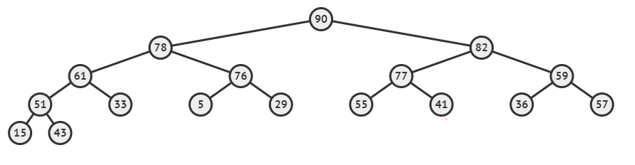

# Problem 1

Trace MergeSort.
Place vertical bars | to delimit the boundaries of the subarray.
Example:  | 4 5 -2 | 3 4 5 |
Always start filling the answer from the left.
Pay attention to the spaces:

one space between numbers
vertical bars in between 2 spaces, except for the leftmost and rightmost

# Problem 2

Draw the max heap resulted after deleting the maximum element.


# Problem 3

Draw the max heap resulted after deleting the maximum element.



# Problem 4

Draw the max heap after inserting the following elements in order.
8, -2, 10, 12, 9, -7, 9, 13, 14, 8, 6, 20, 15, 7, 16

# Problem 5

A min-heap is a complete binary tree where the value of each element is less than the values of its children, if any.

Remark: each value is unique in a heap (it can't be repeated).

We define the following data structure for dynamic implementation of a heap of integers.

```C
typedef int element;
typedef struct node{
	element data;
	struct node *left,*right;
} *heap ;
```

Write a function belong that tests whether or not an element belongs to a heap. An extra parameter is used to count the number of visited nodes.
Write a function `maxheap` that returns the maximum integer in a heap.

A heap A is said to be **domain included** in a heap B if the minimum element of A is greater than or equal to the minimum element of B and if the maximum element of A is less than or equal to the maximum element of B.
Write a function to test if a heap A is **domain included** in a heap B.

# Problem 6

Implement the following function `find_k`:

`int find_k(int A[], int N, int k);`

where A is an array of distinct positive numbers, N the dimension of the array, and k>0. The function calculates the kth smallest element in the array and returns this element or -1 if it doesn't exist.
Use QuickSort in searching for this element without sorting the entire array.

Example : In the following array [11, 4, 7, 8, 2, 9, 23, 30, 10, 14]
The first smallest element is 2, the 2nd smallest element is 4, the 3rd smallest element is 7, ⋯

# Problem 7

Every integer number can be expressed as the multiplication of its prime factors, where those factors are inserted into a min heap (with repeated elements).

Write a function that computes the GCD of 2 numbers represented by 2 heaps.

Available functions:

```C
int GetMinimum(Heap h) // returns the minimum element or -1 if heap is empty
int DeleteMin(Heap *h) // Deletes and returns the minimum element or -1 if heap is empty
```

# Problem 8

Every integer number can be expressed as the multiplication of its prime factors, where those factors are inserted into a min heap (with repeated elements).
Seeing that prime factors can be repeated as in  12 = 2 × 2 × 3 and that can be written using exponents as 12 = 22 × 3, write a function that prints a number using exponents.

Available functions:
```C
int GetMinimum(Heap h) // returns the minimum element or -1 if heap is empty
int DeleteMin(Heap *h) // Deletes and returns the minimum element or -1 if heap is empty
```